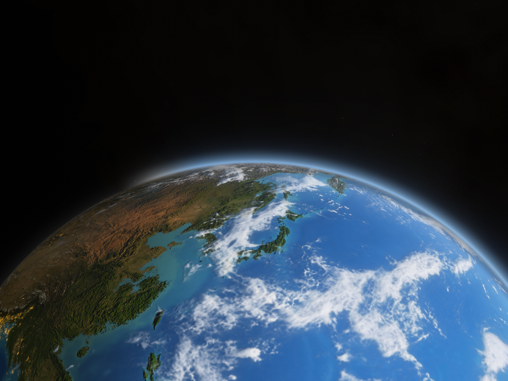

# 地球桌面 (EarthDesk)

Windows 桌面组件套件:实时光照的地球壁纸 + 天气组件 + 机器状态组件。
组件平时完全鼠标穿透,只有按下热键进入编辑模式才能拖动和缩放。



地球是真的:光照按当前时刻的太阳位置算,云是当天的气象卫星图(葵花 9 号可见光 +
红外,每十分钟更新),星空是真实星表,月亮在它真实的位置和相位上。构图、调色、
大气边缘都是对着 Apple 的地球壁纸逐像素量出来的。

仓库:<https://github.com/z398147008-gif/EarthDesk>

## 直接用(不想编译)

1. 下载 [Releases](https://github.com/z398147008-gif/EarthDesk/releases) 里的 `地球桌面_x.y.z_x64-setup.exe`,双击安装。
   - 安装包已内置 WebView2 离线安装包和硬件监控(自带的后台服务,基于 LibreHardwareMonitor 的库
     + PawnIO 驱动),装的过程中会问一次"是否允许此应用对你的设备进行更改",点【是】就全配置好了。
     硬件监控没有窗口、不占托盘、开机自动运行。
   - 安装包没有数字签名,Windows 可能提示"已保护你的电脑":【更多信息】→【仍要运行】。
2. 装完直接能用。托盘右键 →【设置…】:
   - **位置**:国家 / 省·州 / 城市三级下拉(内置 GeoNames 全球 2.5 万个城市,中日港澳台为中文名),
     选好保存,天气和地球一起换过去;
   - 开机自启、组件层级、大小、背景浓淡;
   - 每个组件和组件里的每一块(逐时/每日预报、CPU/显卡/内存/磁盘/温度/风扇)单独开关;
   - **硬件监控**:状态、识别到的硬件;只有真的需要管理员授权时才出现【修复】按钮。
3. `Ctrl + Alt + D` 进出编辑模式,可以拖动、缩放组件,会自动吸附对齐。

联网只用三个服务,中国大陆都能直接访问:Open-Meteo(天气)、NASA GIBS(葵花卫星云图)、
matteason 的全球云图。拉不到时自动退回内置云图,不影响使用。

| 层 | 状态 |
| --- | --- |
| P0 骨架:穿透、编辑模式、吸附、配置持久化 | 完成 |
| P1 地球壁纸 | 完成 |
| P2 天气(当前 + 24 小时 + 7 天) | 完成 |
| P3 机器状态(CPU / 内存 / 磁盘 / 显卡 / 温度 / 风扇) | 完成 |

## 从源码构建

- Rust(stable,MSVC 工具链)
- WebView2 Runtime(Win10/11 通常已预装)
- `cargo install tauri-cli --version "^2"`
- 硬件监控服务 `sensors/EarthDeskSensors.cs` 由 `tools/build-sensors.ps1` 用 Windows 自带的
  .NET Framework 编译器(csc.exe)编译到 `src-tauri/vendor/sensors/`;第一次会调用
  `tools/fetch-vendor.ps1` 下载 LibreHardwareMonitor 的库文件和 PawnIO 驱动安装器
  (第三方二进制,没有进版本库)。`3-打包` 和 `2-运行` 都会自动做这一步。

Node 不是必须的:前端是纯静态 ES module,没有打包步骤。

不想碰命令行的话,仓库里三个 bat 按顺序双击即可:
`1-安装环境.bat`(装 Rust / C++ 生成工具,只做一次)、`2-运行.bat`、`3-打包成安装程序.bat`。

```
cd osaka-desk
cargo tauri dev
```

首次编译几分钟。出图顺序是:壁纸窗口铺满屏幕 → 两个组件淡入 → 约两秒后第一批
天气和传感器数据到位。

打包安装版:

```
cargo tauri build
```

版本号每次打包自动刷新：主、次版本取自 `tauri.conf.json`，第三位是 Git 提交数（`3-打包` 用 `--config` 临时覆盖，不改文件）。安装包每次都会先静默卸载旧版本（用户数据保留），装完默认随系统启动，桌面快捷方式默认不勾选。

产物是 `src-tauri/target/release/bundle/nsis/` 下的 `地球桌面_x.y.z_x64-setup.exe`(用 NSIS 而不是
MSI:WiX 的 light.exe 遇到中文路径会失败)。安装脚本 `src-tauri/windows/hooks.nsh` 在安装时
静默装好 PawnIO 驱动、注册一个开机运行的计划任务启动硬件监控(所以平时不会再弹 UAC)、
并在防火墙里挡住它的本地 Web 服务;卸载时全部清理。

## 操作

- `Ctrl + Alt + D` 进入/退出编辑模式。编辑模式下组件浮现边框,可拖动;右下角有缩放
  手柄;靠近屏幕边缘、屏幕中线或另一个组件的边/中心时会吸附并画出参考线。松手即写盘。
- 托盘图标右键:编辑模式 / 重新载入组件 / 打开配置目录 / 退出。
  组件不进任务栏也不进 Alt+Tab,托盘是唯一的出口。

## 地球壁纸

一个铺满整个虚拟屏幕的窗口,里面是一张全屏 WebGL 片元着色器 —— 没有几何体,
对单位球做解析求交,所以没有网格接缝、没有 three.js 依赖,4K 下也只是一次
光栅化。

- 太阳和月亮的位置按真实时间算(`src/astro.js`,天文年历的低精度公式,
  太阳误差 0.01° 量级,月亮 0.3° 量级),晨昏线、城市灯光、海面镜面反射、
  晨昏线上那道暖色的日出带,都跟着真实时间走。
- 贴图是 NASA 的 Blue Marble 昼面、Black Marble 夜灯、云层合成图,外加水体掩膜
  和法线图,全部内置,不联网。
- 构图按 Apple 地球壁纸的一张截图反解出来:在截图上标出九州、四国、大阪、
  釜山、台湾五个地标和地平线,对同一个相机模型做最小二乘,得到一个悬在
  北纬 19° 上空、朝地平线斜视 23.5° 的相机(过程见 `tools/fit_camera.py`)。
  地标残差 16 像素、地平线残差约 1%。
- 光照和质感也是对着截图量出来的,不是凭感觉:苹果的画面整体罩着一层灰蓝色
  空气光(大气透视),云最亮也只到 ~190/255,饱和度比原始卫星贴图低约四分之一,
  地平线外的辉光是中性灰蓝而不是电光蓝,太空背景是偏暖的深灰。着色器按这几个
  数调到了亮度中位数、高光、饱和度都与截图吻合。
- 陆地起伏用的是自己从 NASA GEBCO 全球高程数据生成的 8K 法线图
  (`tools/make_normal_map.py`),地表是九月的 Blue Marble 8K。
- **云是实时的**:默认每 3 小时拉一次全球云图(基于气象卫星,开源项目
  matteason/live-cloud-maps 生成,8192×4096),所以台风、锋面都是当天真的。
  拉不到时自动退回内置的静态云图。

### 星空不是贴图

`src/textures/stars.bin` 是 28424 颗星的星表(d3-celestial 的 8 等星表,源自
HYG),每颗存成 J2000 赤道坐标系的单位向量 + 星等 + B-V 色指数。每一帧把它们
按格林尼治平恒星时绕极轴转一次到地固坐标系,再用和地球完全相同的相机投影 ——
所以星座在正确的位置,并且随时间缓慢西移,被地球挡住的那一半会消失。星点大小
和亮度来自星等,颜色来自色指数(热星偏蓝白,巨星偏橙)。

### 太阳和月亮

两者都画在真实位置上,被地球挡住时会正确地消失。

月亮按真实距离定大小(地月距离在 57.8 到 63.4 个地球半径之间变化)、按真实
相位打光,贴的是月面图,朝向按潮汐锁定推出来 —— 所以看到的永远是正面,
相位跟窗外的月亮一致。

**但它不常出现。** 相机悬在你头顶 3.1 个地球半径处,地球本身挡掉了大半个天空,
可见的天区只有地平线上方一条窄带。实测 60 天里月亮只有 18 个小时会进入画面,
一般是连续一两个小时,几天一次 —— 像一次月出。太阳更少:本地白天它在相机背后,
夜里它在地球背后。这是真实的几何关系,不是 bug。想多看到一些,把
`camera_distance` 调大(地球变小、天空变多)。

### 图层与桌面图标

默认 `layer: "behind_icons"`:启动时向 Progman 发 `0x052C`,把壁纸窗口 `SetParent`
到 shell 自己的 WorkerW 上,于是桌面图标画在壁纸之上,行为和真壁纸一致。

某些 Win11 版本不肯交出那个 WorkerW。拿不到时会自动退回 `SetParent(Progman)`,
再不行就退到 z 序最底(`sink_to_bottom`)—— 这种情况下桌面图标会被盖住,
把配置里的 `layer` 改成 `"bottom"` 可以固定用后一种模式。

explorer.exe 重启、分辨率变化都可能把窗口踢出那一层,有个 60 秒的看门狗会把它放回去。

"显示桌面"(Win+D)不会销毁任何窗口,但会让组件看不见,分两种情况,由一个每 0.4 秒看一眼的
组件看门狗处理:

- 地球壁纸开着:组件是壁纸窗口的子窗口。可能被隐藏、最小化,或者被壁纸自己的 WebView
  盖到下面(具体是哪种,真机上还没确认),发现哪种就当场纠正。
- 地球壁纸关掉(或层级选"沉底"):组件是沉在 z 序最底的普通窗口。Win+D 会把桌面窗口
  (WorkerW)抬到所有普通窗口前面,组件就被压在下面(真机日志已证实)。程序在主线程上
  监听系统的窗口事件(焦点落到桌面、窗口最小化/还原、桌面窗口显示/隐藏),桌面盖上来的
  同一瞬间把组件升到最顶层,程序窗口回来的同一瞬间放回底部,所以几乎没有可见的空档。
  另有每 0.4 秒一次的轮询作为保险。

正常时它什么都不写,所以不会闪。它每次看到的状态变化,以及每次抬升/放回,都追加写进
`watchdog.log`:从源码目录运行(`2-运行.bat`)时就在本文件夹里,装好的版本在
`%APPDATA%\EarthDesk\`(托盘 →「打开配置目录」)。超过 256 KB 自动丢掉旧的一半。
万一还有没想到的情况,看这个文件就知道当时窗口是什么状态。

## 天气

数据来自 Open-Meteo(无需 API key),默认每 10 分钟拉一次,坐标固定在
大阪市東成区中本(34.6736 / 135.5433),时区 Asia/Tokyo。

版式按系统天气组件做:按天气和昼夜变色的圆角卡片;顶部是地点、当前温度、
天气状况和最高/最低;中间一行从「现在」开始的逐时预报,日出日落按真实分钟
插进去;下面每天一行,温度区间条按冷暖着色、所有行共用同一个刻度。

天气图标用的是 [Meteocons](https://github.com/basmilius/weather-icons)
(MIT 许可,Bas Milius)。苹果天气自己的图标是 Apple 的版权美术,不能拿来用。


拉取失败时不会清屏,而是继续显示上一次的数据并在底部标出"已过期"。

## 机器状态

CPU 占用(总体 + 每逻辑核)、内存、交换、各卷容量来自 `sysinfo`,不需要任何权限。

**温度、风扇转速、显卡占用 / 显存 / 功耗来自内置的硬件监控服务。** Windows 没有读这些的
公开 API。1.0.0 是在后台跑 LibreHardwareMonitor 程序本身(托盘图标 + 8085 端口的网页服务),
1.1 起换成自己的 Windows 服务 `EarthDeskSensors`(`sensors/EarthDeskSensors.cs`),里面用的是
LibreHardwareMonitor 的库(LibreHardwareMonitorLib.dll,原样随附):

- 以 LocalSystem 开机自启,没有窗口,不在托盘里;
- 不开任何网络端口,地球桌面通过命名管道 `\\.\pipe\EarthDeskSensors` 读取,只有本机登录的
  用户能读,网络访问被拒绝;不会和别的程序抢 8085,也不会被 VPN / 代理吞掉;
- 有人来读才采样(最快每 0.8 秒一次),地球桌面不开时不占 CPU;关闭了 LHM 库默认给每个传感器
  保留一天历史的功能(那是界面画曲线用的,常驻进程里就是缓慢的内存增长);
- 服务崩溃由 Windows 服务管理器自动重启;采样卡住 60 秒或内存超过 400 MB 时自己退出,
  交给服务管理器重启;服务被停掉或者不响应时,地球桌面用安装时授予的权限自己把它
  启动 / 重启(`watchdog.log` 里有 `sensors:` 记录),不弹授权框;
- 插拔 U 盘 / 移动硬盘时自动重新枚举磁盘,新插的盘也有温度;开机时没找到显卡(驱动还没起来)
  会在 90 秒后再找一次;
- 移动硬盘盒把温度藏起来(LHM / CrystalDiskInfo 显示“?”)时,服务直接通过硬盘盒的 SAT 转换问硬盘:
  先读 Device Statistics 日志第 5 页的当前温度,不行再读 SMART 194/190;只读命令,每块盘最多
  一分钟一次,硬盘休眠时不去叫醒它。结果以 `USB disk E:` 的名字交给 perf.js,按盘符直接对上;
  机械盘 55°C 起温度标成警示色;
- 运行记录在 `C:\ProgramData\EarthDesk\sensors.log`,安装记录在同目录 `setup.log`。

只有服务或驱动本身坏了才需要用户:设置页出现【修复】,点一下、在 UAC 里点【是】,
它以管理员身份重跑安装时那份 `setup-sensors.ps1`。

服务不响应时,如果 `lhm_url` 指向一个自己运行的 LibreHardwareMonitor 网页服务,会临时用它顶上
(可以写到端口为止,会自动补 `/data.json`,并顺带试本机 127.0.0.1 的同一端口)。

两种来源都没有时组件照常显示 CPU / 内存 / 磁盘,显卡环显示 `--`,底部写明缺的是什么 —— 不会编数字。

## 设置页

托盘右键 →「设置…」。地球桌面、天气、性能三个总开关，外加每个组件内部的分块开关（天气：逐时 / 每日；性能：CPU / 显卡 / 内存 / 磁盘 / 温度 / 风扇）。总开关关掉时子项变灰。另有层级（仅桌面 / 置底 / 置顶）、字号 0.7–1.8×、编辑模式、打开配置目录。开关存在 config.json 的 `features` 里，缺省即开启，改动通过 `features:changed` 事件即时推给各窗口。

## 鼠标手势与快捷键

设置页「鼠标手势」「快捷键」两栏，规则存在 `%APPDATA%\EarthDesk\toolkit.json`（和 config.json 分开，换电脑可以直接拷过去）。

- **手势**：按住右键拖动，识别 8 个方向（可关掉斜向）。只点一下右键时原样补发一次右键，菜单照常；按住不动超过 0.45 秒交还给程序（右键拖动照常）。拖动中按左键或 Esc 取消。
- **默认手势**：← 返回、→ 前进、↑↓ 刷新、↓→ 关闭窗口（浏览器里关闭标签页）、↓← 恢复标签页、↑← / ↑→ 切换标签页、↓ 最小化、↑ 最大化、→↑ / →↓ 到顶 / 到底。
- **动作**：按键组合（可多组依次按）、启动程序、打开网址 / 文件夹 / 文件、输入文字、内置功能（窗口、媒体、音量、锁屏…）、不做任何事（用来在某个程序里屏蔽全局手势）。
- **范围**：每条规则可以是所有程序 / 仅在这些程序 / 除了这些程序。同一手势写了「仅在这些程序」的那条优先。另有整体排除列表；全屏程序（游戏、视频）里默认不接管右键。
- **实现**：`src-tauri/src/toolkit/`。低级鼠标 / 键盘钩子在独立线程上，回调只查表，动作交给工作线程；轨迹是原生分层窗口（Direct2D），只有笔画包围盒那么大。快捷键也走键盘钩子，所以能按程序区分、能录 Win 组合键。
- **管理员身份**：Windows 不让普通权限的程序把手势 / 按键送进管理员窗口（任务管理器等）。安装程序创建计划任务「EarthDesk (用户名)」（最高权限），之后地球桌面每次都通过它以管理员身份启动，不弹 UAC；开机启动也改由这个任务负责。由它启动的程序经 Explorer 转手，仍是普通权限（规则里勾了「以管理员身份运行」的除外）。试运行（`cargo tauri dev`）不提权。
- 托盘菜单「暂停手势和快捷键」可以临时全部停用。

## 截图与贴图

- **F1 截图**（照 Snipaste）：屏幕先由原生窗口冻结，再换成常驻的截图页面，所以按下即停。指针下的窗口和控件（UI Automation）自动高亮，单击选中，滚轮切换层级；放大镜取色（C 复制）；方向键微调；`,` `.` 翻截图记录。标注：矩形、椭圆、直线、箭头、画笔、马克笔、马赛克 / 模糊、文字、序号、橡皮擦，可再次拖动和修改。Enter / 双击复制（剪贴板同时放 DIB 和 PNG），Ctrl+S 保存到「图片\EarthDesk」，Ctrl+Shift+S 另存为，F3 贴到屏幕。代码：`src-tauri/src/capture/`、`src/capture.*`。
- **F3 贴图**：把剪贴板里的图片（含资源管理器里复制的图片文件）或文字贴在最前面；截图时按 F3 贴出选区，原地"浮起"。贴图可拖动、滚轮缩放、Ctrl+滚轮透明度、双击缩略、1/2 旋转、3/4 翻转、空格进入标注、Ctrl+C / Ctrl+S、Esc 关闭，右键菜单里有鼠标穿透（托盘「贴图」里统一取消）。每个贴图是一个透明小窗口（`pin-<id>`，`src/pin.*`，`src-tauri/src/pins.rs`）。

## 剪贴板历史

- 每次复制都记下来（文字含网页格式、图片、文件列表），存在 `%APPDATA%\EarthDesk\clipboard\`（SQLite + PNG），只在本机。同样的内容再复制一次只会移到最前。默认保留 1000 条 / 30 天，收藏的永久保留。
- **Alt+V** 在光标（或指针）旁弹出面板：直接打字搜索，↑↓ 选择，Enter 粘贴回原来的窗口，Shift+Enter 粘贴纯文本，Ctrl+1…9 直接粘贴第几条，Ctrl+P 收藏，Ctrl+T 贴到屏幕，Delete 删除，Esc / 点别处关闭。
- 管理窗口（面板里「管理…」、设置页、或内置功能「剪贴板历史（管理窗口）」）：左边列表、右边完整内容，复制 / 复制为纯文本 / 贴到屏幕 / 收藏 / 删除 / 清空。
- 隐私：密码管理器（KeePass、1Password、Bitwarden 等）里的复制不记录；程序用 `ExcludeClipboardContentFromMonitorProcessing`、`Clipboard Viewer Ignore` 或 `CanIncludeInClipboardHistory = 0` 标记的内容一律跳过。
- 代码：`src-tauri/src/cliphist/`（`store.rs` 有单元测试）、监听在 `toolkit/win/clipboard.rs`、页面 `src/clip.*`。

## 地球桌面输入法

装地球桌面时一起装好（设置页「输入法」栏看状态、改选项）。Win + 空格切到「地球桌面输入法」即可打字。

- **微软双拼**，基于 [librime](https://github.com/rime/librime) 1.17（中州韵引擎）和 [雾凇拼音](https://github.com/iDvel/rime-ice) 的词库：候选按使用频率和最近使用排序、自动造词、整句输入；Shift 切中 / 英，`- =` 翻页，`[ ]` 以词定字，F4 菜单（简繁 / 全角 / Emoji）。
- 按程序默认英文（游戏、终端…）、每页候选数、Emoji、快捷短语（`custom_phrase_double.txt`）在设置页里改。
- 打字时文字里带下划线的是按下的字母（Enter 原样上屏），候选窗第一行是「字母 · 双拼读音」（`rjhz ran hou`）；词库里没有的英文词作为「英」排在候选最后，候选窗不会在打英文时消失。
- 程序自己中途结束了组字（网页类程序换行后重绘输入框时会这样），留在文字里的拼写不会变成正文：光标还在它后面时下一个键接着组字（`tsf/src/edit.rs` 的 `Orphan`）。
- 删除候选：右键候选变红标「删除」，再点一下删除——Rime 用户词库 / Mozc 历史里学到的会忘掉，并记进 `hidden.json`，以后同样的输入不再出现（自带词库里的词两个引擎都删不掉，所以这样兜底）。
- Caps Lock（设置页可改）：默认像 Mac 一样切到英文——打开时字母是小写、Shift 大写，数字标点原样，关掉回到中文。
- 括号、引号成对输入（设置页可关）：打出 （【「『《〈“‘ 时自动补上另一半，光标停在中间；再打右半边时跳过已补上的那个。只管输入法自己放进去的全角符号，程序直接收到的半角括号交给程序（代码编辑器自己会配对）。
- **候选窗皮肤**（设置页「外观」，切换不需要重新部署）：跟随系统；**天气**——候选条从左到右是现在和之后每小时的天气，而且是动的：阳光呼吸、光线缓缓转动，云慢慢飘，雨往下落，雪边飘边落，雾一层层流过，雷雨时云里闪电，晴夜星星闪、偶尔划过流星（约每秒 60 帧，只在候选窗显示时画；Windows 关掉「动画效果」时静止），越长看得越远，角上是气温和「小雨转晴」，数据是地球桌面拉到的 Open-Meteo 天气（写到 `%APPDATA%\EarthDesk\ime\weather.json`）；**时段**——颜色随一天慢慢变（清晨桃粉、上午清蓝、正午暖白、下午琥珀、傍晚珊瑚到淡紫、夜里浅蓝紫），始终是浅色。
- 图标：输入法是蓝底白「中」（`ime/ime.ico`），托盘是单独画的小地球（`src-tauri/icons/tray-*.png`），源文件都在 `src-tauri/icons/src/*.svg`。
- **组成**：`ime/` 是独立的 Cargo 工作区，三个 crate ——
  - `proto`：DLL 和引擎之间的管道协议（长度前缀 + JSON）；
  - `tsf`：`EarthDeskTSF.dll`（64 位）/ `EarthDeskTSF32.dll`（32 位），TSF 文本服务，装进每个打字的程序里。它只转发按键、显示下划线的输入串、插入上屏文字，按键在 `OnTestKeyDown` 里就问完引擎（Weasel 的做法），每次调用 400 毫秒超时，引擎不在时按键原样交给程序；
  - `engine`：`EarthDeskIME.exe`，每个登录会话一个、普通权限，持有 librime、用户词库和候选窗（分层窗口 + Direct2D，跟随系统深浅色）。管道只接受本用户和沙盒（UWP）程序。
- 用户数据在 `%APPDATA%\EarthDesk\ime\`（`rime\` 词库与部署结果、`settings.json`、`ime.log`），只在本机。
- 安装包里的 `ime\EarthDeskIME.exe --register --enable --deploy` 注册两个 DLL、加到当前用户的键盘列表、部署词库；卸载时 `--disable --unregister`。开发时双击 `5-试用输入法.bat`（编译、弹一次 UAC 注册、部署）。
- `2-运行` / `3-打包` 开始前先和 GitHub 同步（`tools/sync.ps1`：记下本地改动 → 拉取合并 main → 上传），并打印这次用的代码版本；GitHub 上有没合并进 main 的 `claude/...` 分支时会提醒。
- 编译：`tools/build-ime.ps1`（`2-运行` / `3-打包` 会自动调用），第三方文件由 `tools/fetch-ime.ps1` 下载到 `src-tauri/vendor/ime/`。
- **日语 / 中日混合**（第二阶段）：日语用 [Mozc](https://github.com/google/mozc) 的转换引擎，编成 `earthdesk_mozc.dll` 在引擎进程里直接调用（`ime/mozc/earthdesk_mozc.cc`，协议就是 Mozc 自己的 `commands::Command` protobuf，不经过 mozc_server）。GitHub Actions（`.github/workflows/mozc.yml`）在 Windows 上编译并发布到 Release `mozc-13c9898`，`tools/build-ime.ps1` 下载；下载不到时输入法只有中文。
  - 默认**中日混合**：同一串字母同时交给双拼（Rime）和罗马字（Mozc），`engine/src/mixed.rs` 分三层决定谁在前：拼不拼得通 → 是不是完整的词（双拼半个音节 vs 罗马字读完）→ 上一次上屏的语言和这串字母以前选过哪边（`%APPDATA%\EarthDesk\ime\langpref.json`）。日语候选标「日」，日语领先时空格进入 Mozc 的转换（分段、换候选、Enter 上屏）。
  - Ctrl+Shift+J 或 `/mix` `/ja` `/zh` 切换模式，每个程序记住（`modes.json`）；日语上屏后按 `` ` `` 在原样 / ひらがな / カタカナ 之间原地替换；F6–F10 假名、半角、英数转换。
  - 逻辑在 `engine/src/compose.rs`；`EarthDeskIME --cli KEYS` 可以在 Linux 上把整个流程跑一遍（需要 `libearthdesk_mozc.so`，`python ime/mozc/build.py <mozc 源码>` 编出来）。
- 路线：第三阶段加上下文语言模型、按键盘距离和上下文的纠错、快捷短语管理。

## 闪屏的根因

组件是弹出窗口，`GetParent` 对弹出窗口返回的是 *owner* 而不是父窗口，于是看门狗每次都判定「不在壁纸层」并重新 `SetParent`，每次重挂都会闪一下。现在统一用 `GetAncestor(GA_PARENT)` 判断，已在正确位置就直接返回；兜底路径只在位置/尺寸真的漂移时才重设；天气图标按内容 diff 更新；实时云图只在新的时段才重新上传，且用 `createImageBitmap` 在后台解码。

## 配置

`%APPDATA%\EarthDesk\config.json`,首次运行自动生成。改完重启应用生效。

| 字段 | 说明 |
| --- | --- |
| `z_mode` | 组件待在哪一层。`desktop`(默认)挂进壁纸窗口,和壁纸一起待在桌面层:画在地球之上、桌面图标之下、所有应用窗口之下;`bottom` 不改父窗口,只沉到 z 序最底,效果接近,是 `desktop` 出问题时的退路;`topmost` 浮在所有窗口之上;`normal` 普通窗口 |
| `ui_scale` | 组件内容的整体缩放倍数。布局本身已经跟随系统 DPI 缩放,这一项是在那之上再放大或缩小 |
| `snap_threshold` | 吸附触发距离(物理像素,默认 12) |
| `edit_hotkey` | 编辑模式热键 |
| `location` | 经纬度、显示名、时区 |
| `weather_refresh_minutes` | 天气刷新间隔 |
| `widgets` | 各组件的位置尺寸,物理像素 |

`wallpaper`:

| 字段 | 默认 | 说明 |
| --- | --- | --- |
| `enabled` | true | 关掉就只留两个组件 |
| `layer` | `behind_icons` | 见上文;`bottom` 为不碰 shell 的退化模式 |
| `camera_anchor` | `location` | 相机经度锁谁:`location` 锁你的城市 / `sun` 锁日下点(大陆会转过去)/ `fixed` 锁死 |
| `camera_offset_deg` | 0.15 | 相对锚点向东偏多少度 |
| `camera_tilt_deg` | 23.54 | 相机从正下方往地平线方向抬起的角度 |
| `camera_heading_deg` | 5.6 | 相机绕竖直轴转的角度 |
| `focal_length` | 1.747 | 焦距(以主屏半高为单位),越大越近 |
| `axis_offset_x` / `axis_offset_y` | -0.03 / 0.546 | 光轴落在主屏上的位置,相对屏幕中心,单位半屏高(y 向下) |
| `live_clouds` | true | 用实时云图 |
| `live_clouds_url` | matteason 的 8K 云图 | 可换成别的等距柱状投影云图地址 |
| `camera_lat_deg` | 16 | 相机纬度,正值把北极转向观众 |
| `camera_lat_deg` | 19 | 相机所在纬度 |
| `camera_distance` | 1.42 | 单位地球半径。调大:地球变小、可见天空变多、地平线变平 |
| `render_scale` | 1.0 | 低于 1 降分辨率渲染再拉伸,4K 上吃力时调 0.75 |
| `cloud_opacity` | 0.9 | 云层浓度 |
| `city_lights` | 1.0 | 夜面城市灯光亮度 |
| `stars` | 0.4 | 星空亮度,0 关掉 |
| `sun` | 1.0 | 太阳亮度,0 关掉 |
| `moon` | 1.0 | 月亮亮度,0 关掉 |
| `max_fps` | 15 | 地球每分钟转 0.25°,15 帧已经远超所需 |
| `frame_monitor` | `primary` | 构图以哪块屏幕为准。壁纸窗口铺满所有显示器;`virtual` 会把地球放在所有屏幕拼起来的正中,双屏时通常落在接缝上 |
| `drift_deg_per_hour` | 0 | 在真实自转之外额外加的转速,调试用 |

`sensors`:

| 字段 | 默认 |
| --- | --- |
| `lhm_url` | `http://127.0.0.1:8085/data.json`(只在内置服务不响应时作为备用) |
| `sample_ms` | 2000 |

坐标一律按物理像素存储,这样换缩放比例或换显示器时位置不会漂。首次运行
(配置里还没有某个组件)时,默认尺寸按逻辑像素乘以所在显示器的缩放比例算出来。

配置带 `version` 字段。代码里的默认值变了、而旧配置会把新默认值盖住时,就把
`CURRENT_VERSION` 加一:版本落后的配置会被重置一次,只保留位置、传感器、热键、
刷新间隔和吸附距离。第一轮真机测试"改动没生效"就是这个原因 —— 首次运行写下的
`z_mode: "topmost"` 和旧构图参数一直覆盖着后来的默认值。

## 目录

```
src-tauri/
  src/main.rs        窗口装配、托盘、热键、拖拽缩放命令、三个后台循环
  src/config.rs      配置结构与读写
  src/snap.rs        吸附计算与参考线
  src/platform.rs    Win32:免激活、免 Alt+Tab、z 序、WorkerW 注入
  src/wallpaper.rs   壁纸窗口的铺屏与图层看门狗
  src/weather.rs     Open-Meteo 客户端
  src/sysmon.rs      sysinfo 采样 + 读硬件监控服务(命名管道)
  src/environment.rs 硬件监控服务的状态 / 启动 / 修复,开机自启
  windows/hooks.nsh  安装包钩子:装驱动和服务、清理 1.0.0 的 LHM
ime/                 地球桌面输入法（独立 Cargo 工作区，见上文）
  proto/ tsf/ engine/
sensors/
  EarthDeskSensors.cs  硬件监控服务(C# 5,基于 LibreHardwareMonitorLib)
  setup-sensors.ps1    安装 / 修复 / 卸载服务(需要管理员)
  capabilities/      Tauri 2 ACL:前端只拿到 listen 和读自身几何
src/
  wallpaper.html     壁纸窗口
  earth.js           地球渲染与总装(WebGL2 片元着色器)
  sky.js             真实星空、太阳、月亮的渲染
  astro.js           太阳/月亮位置、恒星时、坐标系转换
  glutil.js          WebGL 样板
  index.html         天气组件
  weather.js/.css    天气渲染
  wmo.js             WMO 天气代码 → 文案与图标
  perf.html          机器状态组件
  perf.js/.css       状态渲染
  guides.html        全屏参考线图层
  widget.js          拖拽/缩放/编辑模式/随窗口缩放的 rem 基准
  shared.css         组件外壳样式
  textures/          NASA 贴图、月面图、星表(约 5.5 MB)
```

## 已知边界

- 多显示器时壁纸铺满整个虚拟桌面,地球按主屏构图(`frame_monitor`),副屏只显示星空。
- 编辑模式的吸附只认当前组件所在的那块显示器。
- 组件挂进壁纸窗口这件事依赖 `SetParent` 对两个 WebView2 窗口都成立。如果
  发现组件不显示或透明出问题,把 `z_mode` 改成 `"bottom"`。
- 编辑模式会临时把组件摘出桌面层变回普通窗口(否则鼠标事件会被桌面图标层
  吃掉),退出编辑模式再挂回去。
- 月亮和太阳大部分时间不在画面里,见上文。


## 许可

本项目的代码以 MIT 许可发布,见 [LICENSE](LICENSE)。

用到的数据、素材和第三方程序各有各的许可(NASA 贴图与卫星云图、GeoNames 城市库、
Meteocons 图标、LibreHardwareMonitor 的库、PawnIO 驱动、Open-Meteo),清单和链接见
[THIRD_PARTY.md](THIRD_PARTY.md)。安装包里附带的 LibreHardwareMonitorLib 与 PawnIO
分别按 MPL-2.0 和 GPL-2.0-or-later 分发,对应源码在那份清单里给了地址。
